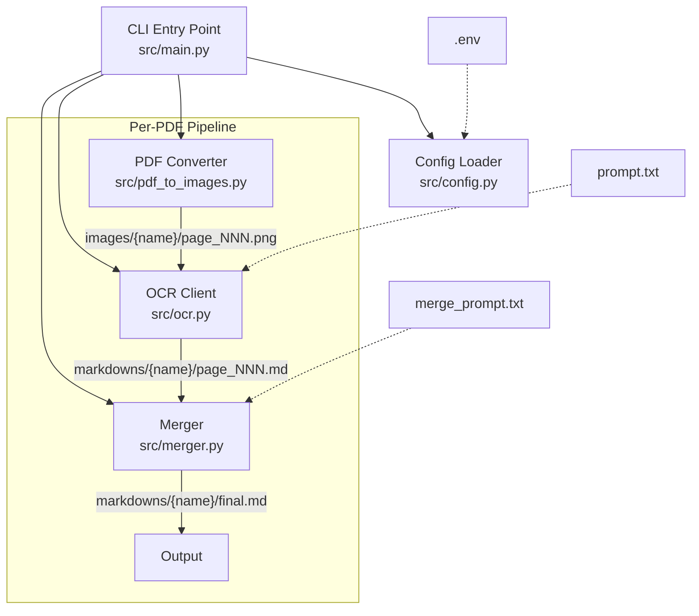

# Design Document: OCR PDF to Markdown

## Overview

This application is a Python CLI tool that converts PDF files to Markdown using LLM-based OCR. The pipeline processes all PDFs in an `inputs/` directory through three stages: PDF-to-image conversion (via pdf2image/poppler), async LLM-based OCR (via OpenAI-compatible API with httpx), and Markdown merging (simple concatenation or LLM-based smart merge). Configuration is managed through a `.env` file using python-dotenv.

The design prioritizes:
- **Resumability**: Each stage checks for existing output files before processing, allowing interrupted runs to continue where they left off.
- **Concurrency control**: An `asyncio.Semaphore` gates concurrent LLM API calls, configurable from sequential (1) to parallel (N).
- **Provider flexibility**: The OpenAI-compatible `/v1/chat/completions` endpoint works with local servers (LM Studio, Ollama) and cloud providers (DeepSeek, OpenAI) without code changes.
- **Robustness**: Retry with exponential backoff handles transient API failures; per-file error isolation ensures one bad PDF doesn't halt the batch.

## Architecture

The application follows a linear pipeline architecture with four modules orchestrated by a CLI entry point.



### Data Flow

1. **Config Loading**: `config.py` reads `.env` via python-dotenv, validates required fields, applies defaults.
2. **PDF Discovery**: `main.py` scans `inputs/` for `*.pdf` files.
3. **Per-PDF Processing** (sequential across PDFs):
   a. **Image Conversion**: `pdf_to_images.py` converts each page to PNG in `images/{pdf_name}/`.
   b. **OCR**: `ocr.py` sends page images to the LLM API concurrently (bounded by semaphore), saves Markdown to `markdowns/{pdf_name}/`.
   c. **Merge**: `merger.py` combines page Markdown files into `markdowns/{pdf_name}/final.md`.
4. **Exit**: CLI reports summary and exits with appropriate code.

### Design Decisions

| Decision | Choice | Rationale |
|---|---|---|
| HTTP client | httpx (async) | Native async/await support, connection pooling, timeout control. Required by Req 3.9. |
| Concurrency model | asyncio + Semaphore | Lightweight coroutine-based concurrency. Semaphore provides simple, configurable throttling without thread pools. |
| PDF library | pdf2image (poppler) | Mature, well-tested wrapper around poppler. Handles multi-page PDFs, configurable DPI. |
| Config management | python-dotenv | Simple `.env` file loading. No complex config framework needed for 7 variables. |
| Retry strategy | Exponential backoff | Standard approach for transient API errors. Base delay of 2 seconds, doubling each retry. |
| Sequential PDF processing | Process PDFs one at a time | Avoids overwhelming the LLM API. Concurrency is applied within a single PDF's pages. |
| Resume strategy | File existence check | Simple and reliable. If `page_001.png` exists, skip conversion for that page. Same for `.md` files. |

## Components and Interfaces

### 1. Config Loader (`src/config.py`)

```python
from dataclasses import dataclass

@dataclass(frozen=True)
class AppConfig:
    """Immutable application configuration loaded from .env file."""
    llm_base_url: str          # Required. Base URL for OpenAI-compatible API.
    llm_api_key: str           # Optional. API key for authentication. Defaults to "".
    llm_model: str             # Required. Model identifier (e.g., "deepseek-chat").
    max_concurrency: int       # Max concurrent OCR requests. Default: 1.
    max_retries: int           # Max retry attempts per request. Default: 3.
    smart_merge: bool          # Use LLM-based smart merge. Default: False.
    image_dpi: int             # DPI for PDF-to-image conversion. Default: 300.


def load_config(env_path: str = ".env") -> AppConfig:
    """
    Load configuration from .env file.
    
    Raises:
        ConfigError: If LLM_BASE_URL or LLM_MODEL is missing.
    Returns:
        AppConfig with validated values.
    """
    ...


class ConfigError(Exception):
    """Raised when required configuration is missing or invalid."""
    pass
```

### 2. PDF Converter (`src/pdf_to_images.py`)

```python
from pathlib import Path

def convert_pdf_to_images(
    pdf_path: Path,
    output_dir: Path,
    dpi: int = 300,
) -> list[Path]:
    """
    Convert each page of a PDF to a PNG image.
    
    Args:
        pdf_path: Path to the input PDF file.
        output_dir: Directory to save images (e.g., images/{pdf_name}/).
        dpi: Resolution for image conversion.
    
    Returns:
        List of paths to generated/existing PNG files, ordered by page number.
        Skips pages where the output file already exists (resume support).
    
    Raises:
        PdfConversionError: If the PDF is corrupted or unreadable.
    """
    ...


class PdfConversionError(Exception):
    """Raised when a PDF file cannot be converted."""
    pass
```

**Implementation notes**:
- Uses `pdf2image.convert_from_path(pdf_path, dpi=dpi)` to get a list of PIL Image objects.
- For resume: before converting, check if `output_dir/page_NNN.png` exists for each page. If all pages exist (determined by counting existing files matching the pattern), return early. Otherwise, convert only missing pages by using `first_page` and `last_page` parameters or by converting all and only saving missing ones.
- Filenames use zero-padded 3-digit page numbers: `page_001.png`, `page_002.png`, etc.
- Creates `output_dir` with `Path.mkdir(parents=True, exist_ok=True)`.

### 3. OCR Client (`src/ocr.py`)

```python
import asyncio
from pathlib import Path
from src.config import AppConfig

async def ocr_pages(
    image_paths: list[Path],
    output_dir: Path,
    config: AppConfig,
    prompt_text: str,
) -> list[Path]:
    """
    Send page images to LLM API for OCR and save results as Markdown.
    
    Args:
        image_paths: Ordered list of page image paths.
        output_dir: Directory to save Markdown files (e.g., markdowns/{pdf_name}/).
        config: Application configuration.
        prompt_text: OCR prompt loaded from prompt.txt.
    
    Returns:
        List of paths to generated/existing Markdown files.
        Skips pages where the output .md file already exists (resume support).
    """
    ...


async def _ocr_single_page(
    image_path: Path,
    output_path: Path,
    config: AppConfig,
    prompt_text: str,
    semaphore: asyncio.Semaphore,
    client: httpx.AsyncClient,
) -> Path:
    """
    Process a single page: encode image, call LLM API, save result.
    Retries up to config.max_retries times with exponential backoff.
    
    Raises:
        OcrError: If all retry attempts are exhausted.
    """
    ...


class OcrError(Exception):
    """Raised when OCR processing fails after all retries."""
    pass
```

**LLM API Request Format** (OpenAI-compatible `/v1/chat/completions`):

```json
{
    "model": "<LLM_MODEL>",
    "messages": [
        {
            "role": "user",
            "content": [
                {"type": "text", "text": "<prompt_text>"},
                {
                    "type": "image_url",
                    "image_url": {
                        "url": "data:image/png;base64,<base64_encoded_image>"
                    }
                }
            ]
        }
    ]
}
```

**Retry logic**:
- On HTTP error (status >= 400) or `httpx.TimeoutException` or `httpx.RequestError`, wait `2^attempt` seconds, then retry.
- After `max_retries` failures, log the error and raise `OcrError`.

**Concurrency**:
- Create one `asyncio.Semaphore(config.max_concurrency)`.
- Create one `httpx.AsyncClient` with appropriate timeout (e.g., 120s for large images).
- Launch all page OCR tasks with `asyncio.gather(*tasks, return_exceptions=True)`.
- Each task acquires the semaphore before making the HTTP request.

### 4. Merger (`src/merger.py`)

```python
from pathlib import Path
from src.config import AppConfig

async def merge_pages(
    markdown_paths: list[Path],
    output_path: Path,
    config: AppConfig,
    merge_prompt_text: str | None = None,
) -> Path:
    """
    Merge individual page Markdown files into a single final.md.
    
    Args:
        markdown_paths: Ordered list of page Markdown file paths.
        output_path: Path for the merged output (e.g., markdowns/{pdf_name}/final.md).
        config: Application configuration.
        merge_prompt_text: Content of merge_prompt.txt. None triggers fallback to simple merge.
    
    Returns:
        Path to the merged Markdown file.
    """
    ...


def _simple_merge(markdown_paths: list[Path]) -> str:
    """
    Concatenate page Markdown files with <!-- Page X --> separators.
    Pages are ordered by numeric page number extracted from filename.
    
    Returns:
        Merged Markdown content as a string.
    """
    ...


async def _smart_merge(
    content: str,
    config: AppConfig,
    merge_prompt_text: str,
) -> str:
    """
    Send concatenated content to LLM API for intelligent merging.
    
    Returns:
        LLM-processed merged Markdown content.
    """
    ...
```

### 5. CLI Entry Point (`src/main.py`)

```python
import asyncio
import logging
import sys
from pathlib import Path

async def main() -> int:
    """
    Main entry point. Discovers PDFs, runs pipeline, returns exit code.
    
    Returns:
        0 if all PDFs processed successfully, 1 if any failures occurred.
    """
    ...


def _discover_pdfs(inputs_dir: Path) -> list[Path]:
    """Return sorted list of .pdf files in the inputs directory."""
    ...


if __name__ == "__main__":
    sys.exit(asyncio.run(main()))
```

**Logging**: Uses Python's `logging` module configured at INFO level. Logs to stderr. Format: `%(asctime)s - %(levelname)s - %(message)s`.

### 6. Package Init (`src/__init__.py`)

Empty file to make `src` a Python package, enabling `python -m src.main`.

## Data Models

### Configuration Model

| Field | Type | Source | Default | Validation |
|---|---|---|---|---|
| `llm_base_url` | `str` | `LLM_BASE_URL` | — (required) | Must be non-empty |
| `llm_api_key` | `str` | `LLM_API_KEY` | `""` | None (optional) |
| `llm_model` | `str` | `LLM_MODEL` | — (required) | Must be non-empty |
| `max_concurrency` | `int` | `MAX_CONCURRENCY` | `1` | Must be ≥ 1 |
| `max_retries` | `int` | `MAX_RETRIES` | `3` | Must be ≥ 0 |
| `smart_merge` | `bool` | `SMART_MERGE` | `False` | Parsed from string: "true"/"1" → True |
| `image_dpi` | `int` | `IMAGE_DPI` | `300` | Must be > 0 |

### File System Layout

```
project_root/
├── .env                          # User configuration
├── .env.example                  # Template with all variables documented
├── prompt.txt                    # OCR prompt for LLM
├── merge_prompt.txt              # Smart merge prompt for LLM
├── requirements.txt              # Pinned dependencies
├── inputs/                       # User places PDF files here
│   ├── document1.pdf
│   └── document2.pdf
├── images/                       # Generated PNG images (intermediate)
│   ├── document1/
│   │   ├── page_001.png
│   │   ├── page_002.png
│   │   └── ...
│   └── document2/
│       └── ...
├── markdowns/                    # Generated Markdown files (output)
│   ├── document1/
│   │   ├── page_001.md
│   │   ├── page_002.md
│   │   ├── ...
│   │   └── final.md
│   └── document2/
│       └── ...
└── src/
    ├── __init__.py
    ├── __main__.py               # Enables `python -m src`
    ├── main.py                   # CLI orchestration
    ├── config.py                 # Configuration loading
    ├── pdf_to_images.py          # PDF to PNG conversion
    ├── ocr.py                    # LLM-based OCR
    └── merger.py                 # Markdown merging
```

### LLM API Response Model

The OCR client expects the standard OpenAI chat completion response:

```json
{
    "choices": [
        {
            "message": {
                "content": "<extracted markdown text>"
            }
        }
    ]
}
```

The client extracts `choices[0].message.content` as the Markdown output for each page.

## Correctness Properties

*A property is a characteristic or behavior that should hold true across all valid executions of a system — essentially, a formal statement about what the system should do. Properties serve as the bridge between human-readable specifications and machine-verifiable correctness guarantees.*

### Property 1: Configuration round-trip

*For any* valid set of configuration values (non-empty LLM_BASE_URL, non-empty LLM_MODEL, arbitrary LLM_API_KEY, positive integer MAX_CONCURRENCY, non-negative integer MAX_RETRIES, boolean SMART_MERGE, positive integer IMAGE_DPI), writing them to a `.env` file and loading via `load_config` SHALL produce an `AppConfig` with fields matching the original values.

**Validates: Requirements 1.2**

### Property 2: Missing required config raises error

*For any* `.env` file content that is missing `LLM_BASE_URL`, `LLM_MODEL`, or both, calling `load_config` SHALL raise a `ConfigError` whose message contains the name of each missing variable.

**Validates: Requirements 1.7**

### Property 3: Image output naming convention

*For any* PDF name (alphanumeric with underscores/hyphens) and any page count (1 to 999), the generated image paths SHALL follow the pattern `images/{pdf_name}/page_NNN.png` where NNN is a zero-padded 3-digit page number starting from 001.

**Validates: Requirements 2.2**

### Property 4: Image conversion resume skips existing files

*For any* set of page numbers and any subset of those pages that already have corresponding PNG files on disk, the PDF converter SHALL only convert pages whose output files do not yet exist.

**Validates: Requirements 2.3**

### Property 5: OCR request formation

*For any* PNG image data and any prompt text, the OCR client SHALL construct an API request where the messages array contains the prompt text and a base64-encoded data URI of the image, the model field matches the configured LLM_MODEL, and the endpoint is `/v1/chat/completions`.

**Validates: Requirements 3.1, 3.2**

### Property 6: OCR output saving

*For any* PDF name, page number, and LLM response content string, the OCR client SHALL save the response content to `markdowns/{pdf_name}/page_NNN.md` where NNN matches the page number's zero-padded format.

**Validates: Requirements 3.3**

### Property 7: OCR resume skips existing files

*For any* set of page image paths and any subset of those pages that already have corresponding Markdown files on disk, the OCR client SHALL only send API requests for pages whose output `.md` files do not yet exist.

**Validates: Requirements 3.4**

### Property 8: Retry attempts match configuration

*For any* `max_retries` value (0 to 10), when the LLM API consistently returns errors, the OCR client SHALL make exactly `max_retries + 1` total attempts (1 initial + max_retries retries) before raising an `OcrError`.

**Validates: Requirements 3.7**

### Property 9: Simple merge preserves content and ordering

*For any* set of page Markdown files with arbitrary content and arbitrary page numbers, the simple merge output SHALL contain all page contents in ascending numeric page order, separated by `<!-- Page X -->` HTML comments where X matches each page's number.

**Validates: Requirements 4.2, 4.5**

### Property 10: PDF discovery filters by extension

*For any* directory containing a mix of `.pdf` files and non-`.pdf` files, the discovery function SHALL return exactly the `.pdf` files and no others.

**Validates: Requirements 5.1**

## Error Handling

### Configuration Errors

| Error Condition | Handling | Module |
|---|---|---|
| `.env` file not found | python-dotenv silently returns empty; required field validation catches missing values | `config.py` |
| `LLM_BASE_URL` missing | Raise `ConfigError` with message: `"Missing required configuration: LLM_BASE_URL"` | `config.py` |
| `LLM_MODEL` missing | Raise `ConfigError` with message: `"Missing required configuration: LLM_MODEL"` | `config.py` |
| Both required fields missing | Raise `ConfigError` listing both missing variables | `config.py` |
| Invalid integer for `MAX_CONCURRENCY`, `MAX_RETRIES`, `IMAGE_DPI` | Raise `ConfigError` with descriptive message | `config.py` |

### PDF Conversion Errors

| Error Condition | Handling | Module |
|---|---|---|
| Corrupted/unreadable PDF | Log error with filename, skip this PDF, continue batch | `pdf_to_images.py` |
| poppler not installed | `pdf2image` raises `PDFInfoNotInstalledError`; log error and exit | `main.py` |
| Disk full / write permission error | Let `OSError` propagate; log and skip this PDF | `pdf_to_images.py` |

### OCR Errors

| Error Condition | Handling | Module |
|---|---|---|
| HTTP 4xx/5xx from LLM API | Retry up to `max_retries` times with exponential backoff (2^attempt seconds) | `ocr.py` |
| Request timeout | Same retry logic as HTTP errors | `ocr.py` |
| Connection error (server down) | Same retry logic; after exhaustion, log error, skip page | `ocr.py` |
| All retries exhausted for a page | Log error identifying the page, continue with remaining pages | `ocr.py` |
| Invalid/empty API response | Treat as error, trigger retry | `ocr.py` |
| Authentication failure (401/403) | Retry (in case of transient auth issues); after exhaustion, log error | `ocr.py` |

### Merge Errors

| Error Condition | Handling | Module |
|---|---|---|
| `merge_prompt.txt` missing with `SMART_MERGE=true` | Log warning, fall back to simple merge | `merger.py` |
| Smart merge LLM API failure | Log error, fall back to simple merge | `merger.py` |
| No page Markdown files found | Log warning, skip merge for this PDF | `merger.py` |

### CLI-Level Errors

| Error Condition | Handling | Module |
|---|---|---|
| `inputs/` directory missing | Log informative message, exit code 0 | `main.py` |
| No `.pdf` files in `inputs/` | Log informative message, exit code 0 | `main.py` |
| One or more PDFs fail | Continue processing remaining PDFs, exit code 1 | `main.py` |
| All PDFs succeed | Exit code 0 | `main.py` |
| `ConfigError` during startup | Log error message, exit code 1 | `main.py` |

## Testing Strategy

### Testing Approach

The project uses a dual testing approach:

- **Unit tests** (pytest): Verify specific examples, edge cases, error conditions, and integration points.
- **Property-based tests** (Hypothesis): Verify universal properties across randomly generated inputs, providing comprehensive coverage of the input space.

Both are complementary — unit tests catch concrete bugs with readable examples, while property tests verify general correctness across hundreds of generated inputs.

### Property-Based Testing Configuration

- **Library**: [Hypothesis](https://hypothesis.readthedocs.io/) for Python
- **Minimum iterations**: 100 per property test (`@settings(max_examples=100)`)
- **Tag format**: Each property test includes a comment referencing its design property:
  ```python
  # Feature: ocr-pdf-to-markdown, Property 1: Configuration round-trip
  ```

### Test Plan

#### Unit Tests (pytest)

| Test | Validates | Type |
|---|---|---|
| Config loads all values from .env | Req 1.1 | Example |
| Config defaults: MAX_CONCURRENCY=1 | Req 1.3 | Example |
| Config defaults: MAX_RETRIES=3 | Req 1.4 | Example |
| Config defaults: SMART_MERGE=false | Req 1.5 | Example |
| Config defaults: IMAGE_DPI=300 | Req 1.6 | Example |
| PDF conversion creates output directory | Req 2.4 | Example |
| Corrupted PDF logs error and skips | Req 2.5 | Edge case |
| OCR concurrency=1 processes sequentially | Req 3.6 | Example |
| OCR exhausted retries logs error, continues | Req 3.8 | Edge case |
| Merge output at correct path | Req 4.1 | Example |
| Smart merge calls LLM API with merge prompt | Req 4.3 | Integration |
| Missing merge_prompt.txt falls back to simple merge | Req 4.4 | Edge case |
| CLI processes all PDFs in pipeline | Req 5.2 | Integration |
| CLI logs file name, page number, status | Req 5.3 | Example |
| CLI exit code 0 on success | Req 5.4 | Example |
| CLI exit code non-zero on failure | Req 5.5 | Example |
| CLI handles empty/missing inputs/ | Req 5.6 | Edge case |
| Entry points are importable | Req 6.1 | Smoke |
| .env.example contains all variables | Req 6.2 | Smoke |
| prompt.txt exists with OCR instructions | Req 6.3 | Smoke |
| merge_prompt.txt exists | Req 6.4 | Smoke |
| requirements.txt has pinned versions | Req 7.5 | Smoke |

#### Property-Based Tests (Hypothesis)

| Property Test | Design Property | Validates |
|---|---|---|
| Config values round-trip through .env file | Property 1 | Req 1.2 |
| Missing required fields raise ConfigError | Property 2 | Req 1.7 |
| Image paths follow naming convention | Property 3 | Req 2.2 |
| Resume skips existing image files | Property 4 | Req 2.3 |
| OCR request body is correctly formed | Property 5 | Req 3.1, 3.2 |
| OCR output saved to correct path with correct content | Property 6 | Req 3.3 |
| OCR resume skips existing markdown files | Property 7 | Req 3.4 |
| Retry count matches max_retries config | Property 8 | Req 3.7 |
| Simple merge preserves all content in page order | Property 9 | Req 4.2, 4.5 |
| PDF discovery returns only .pdf files | Property 10 | Req 5.1 |

### Test File Organization

```
tests/
├── conftest.py                  # Shared fixtures (temp dirs, mock configs)
├── test_config.py               # Config loader unit + property tests
├── test_pdf_to_images.py        # PDF converter unit + property tests
├── test_ocr.py                  # OCR client unit + property tests
├── test_merger.py               # Merger unit + property tests
├── test_main.py                 # CLI orchestration unit tests
└── test_smoke.py                # Smoke tests for project structure
```

### Mocking Strategy

- **LLM API calls**: Mock `httpx.AsyncClient` to return controlled responses. No real API calls in tests.
- **pdf2image**: Mock `convert_from_path` to return PIL Image objects without requiring poppler.
- **File system**: Use `tmp_path` pytest fixture for isolated file system operations.
- **Environment**: Use `monkeypatch` to control environment variables and `.env` file content.
